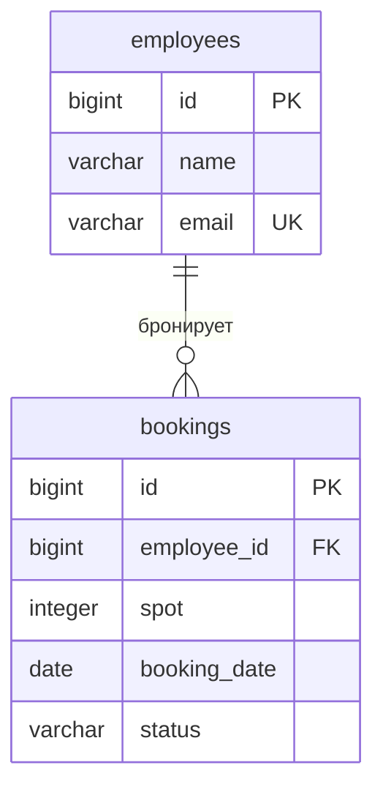

# КР1. Корпоративная парковка

Консольное приложение на Java 21 + PostgreSQL + JDBC. Две сущности: сотрудник и бронирование парковочного места. На парковке 50 мест, бронирование действует целый день. Без Spring и дополнительных слоёв DTO/Mapper.

## Запуск

На этом компьютере Java и Maven уже находятся в `.tools`, PostgreSQL установлен отдельно.

1. Для загрузки примеров выполните один раз:
   ```powershell
   powershell -NoProfile -ExecutionPolicy Bypass -File .\scripts\seed.ps1
   ```
2. Откройте `run.cmd`. Он запускает PostgreSQL проекта, создаёт таблицы, собирает приложение и открывает меню. Каждый запуск использует отдельную временную копию JAR, поэтому пересборка не затрагивает уже открытое приложение.
3. Выберите пункт 3 для просмотра бронирований, 15 для статистики, 16 для экспорта.

Экспорт сохраняется в `export/parking.xlsx`: листы «Сотрудники» и «Бронирования».
Первой сборке нужен интернет для загрузки Maven-зависимостей. Последующие запуски используют локальный кэш.
Данные сохраняются в `.local/pgdata`. Демонстрационные данные: 5 сотрудников, 10 бронирований и все 4 статуса. `seed.ps1` заполняет только пустые таблицы; повторный запуск ничего не дублирует.

### На другом компьютере

Установите JDK 21, Maven и PostgreSQL. Создайте базу `pksjava`, выполните в ней `sql/schema.sql`, затем при необходимости `sql/seed.sql` от имени владельца таблиц. Например:

```powershell
createdb -U postgres pksjava
psql -U postgres -d pksjava -f sql/schema.sql
psql -U postgres -d pksjava -f sql/seed.sql
$env:DB_URL = 'jdbc:postgresql://localhost:5432/pksjava'
$env:DB_USER = 'postgres'
$env:DB_PASSWORD = 'ваш пароль'
mvn package
java -jar target/parking-1.0-SNAPSHOT.jar
```

Для локального окружения этого проекта: `127.0.0.1:5433`, база `pksjava`, роль `pks_app`. Пароль находится в `.local/credentials.json` и не включается в Git. Скрипты `run.ps1` и `env.ps1` рассчитаны на это окружение; с другой базой запускайте JAR напрямую.

## Возможности по требованиям КР1

| Требование | Реализация |
|---|---|
| Две связанные сущности | `Employee`, `Booking`, внешний ключ `employee_id` |
| CRUD бронирований | Создание, список, ID, изменение места/даты, удаление |
| Enum | `CREATED`, `CONFIRMED`, `COMPLETED`, `CANCELLED` |
| Два поиска | Фрагмент ФИО без учёта регистра; номер места |
| Два фильтра | Статус; период дат включительно |
| Две сортировки | Дата; номер места (по возрастанию) |
| Статистика | 7 показателей: сотрудники, брони, 4 статуса, занятые места сегодня |
| Excel | Apache POI, настоящий `.xlsx`, два листа |
| Просмотр таблиц | Пункт 17: имена таблиц БД и содержимое таблиц парковки |
| JDBC | PreparedStatement, параметры, ResultSet, try-with-resources |
| Ограничения БД | PRIMARY KEY, FOREIGN KEY, NOT NULL, UNIQUE, CHECK |
| ООП | Модели, конструкторы, private-поля, интерфейс репозитория, enum, своё исключение |
| Collections / Stream | List, Set, Map, поиск, фильтрация, сортировка, статистика |

## Структура

```text
src/main/java/ru/pks/
  App.java                          точка входа
  config/Database.java              подключение к PostgreSQL
  model/Employee.java               сотрудник
  model/Booking.java                бронирование
  model/BookingStatus.java          статусы и переходы
  repository/ParkingRepository.java интерфейс хранилища
  repository/JdbcParkingRepository.java  SQL и JDBC
  service/ParkingService.java       правила, поиск, фильтры, статистика
  ui/ConsoleMenu.java               ввод и вывод
  util/ExcelExporter.java           экспорт XLSX
  exception/DataAccessException.java    ошибка базы
sql/schema.sql                      таблицы и ограничения
sql/seed.sql                        демонстрационные данные
```

Меню → сервис → интерфейс репозитория → JDBC → PostgreSQL.
`record` — компактный неизменяемый класс: его поля автоматически `private final`, конструктор и методы доступа создаёт Java. Полиморфизм: сервис работает с `ParkingRepository`; в приложении это JDBC, в модульных тестах — коллекция в памяти.

## Правила

1. Имя сотрудника обязательно, от 1 до 100 символов.
2. Почта должна иметь корректный формат и быть уникальной; сохраняется в нижнем регистре.
3. Бронировать может только существующий сотрудник.
4. Номер места — от 1 до 50.
5. Нельзя создать или перенести бронь на прошедшую дату.
6. Нельзя занять уже забронированное на эту дату место.
7. У сотрудника может быть только одна активная бронь на день.
8. Новая бронь получает `CREATED`. Переходы: `CREATED → CONFIRMED/CANCELLED`, `CONFIRMED → COMPLETED/CANCELLED`.
9. Завершённые и отменённые брони нельзя редактировать или возвращать в работу. Будущую бронь нельзя завершить.
10. Отмена освобождает место. Отменить просроченную бронь разрешено.

Активные статусы: `CREATED`, `CONFIRMED`. Удаление любой брони разрешено как операция CRUD. История брони после удаления не сохраняется. Для учебного приложения все пользователи имеют одинаковый доступ.

Правила проверяются в сервисе. Уникальные индексы дополнительно защищают от двойного бронирования в БД. Каждая запись меняется одним SQL-запросом с autocommit. Некорректные числа, даты, статусы, отсутствующие ID и ошибки БД возвращают пользователя в меню.

## ER-диаграмма



У одного сотрудника несколько бронирований; каждое относится к одному сотруднику. Места представлены номерами 1–50. Уникальные пары `(spot, booking_date)` и `(employee_id, booking_date)` действуют только для активных статусов.

## Проверка

```powershell
# Модульные тесты
.\scripts\maven.ps1 test
# Все тесты, включая PostgreSQL и чтение экспортированного Excel
.\scripts\test.ps1
```

Интеграционный тест создаёт отдельную временную схему и удаляет её после проверки. Рабочие данные не меняются. Проверяются CRUD, ограничения БД, повторная загрузка примеров, сохранение между соединениями и содержимое XLSX. После сборки дополнительно проверяются создание, изменение и удаление брони через консоль готового JAR.

Для демонстрации: список сотрудников → создание брони на будущую дату → попытка занять то же место → подтверждение → поиск и фильтры → статистика → Excel → отмена → повторное бронирование освобождённого места.
