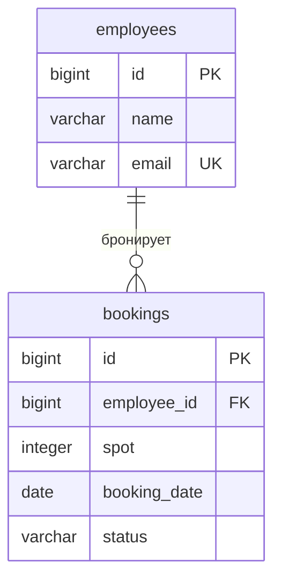

# Корпоративная парковка — КР1

Java 21, PostgreSQL, JDBC. Сотрудники и бронирование одного из 50 мест на целый день.

## Как пользоваться

Из терминала в папке проекта:

```powershell
.\run.cmd test    # проверить программу, базу и готовый JAR
.\run.cmd seed    # добавить примеры, только если обе таблицы пустые
.\run.cmd build   # собрать JAR без запуска
```

## Что лежит в проекте

| Файл / папка | Зачем |
|---|---|
| `src/main/java` | Код программы |
| `src/main/resources` | Настройка логирования библиотеки Excel |
| `src/test/java` | Тесты |
| `sql/schema.sql` | Создание таблиц |
| `sql/seed.sql` | 5 сотрудников и 10 примерных бронирований |
| `pom.xml` | Зависимости и сборка Maven |
| `run.cmd` | Запуск двойным щелчком; также принимает команды выше |
| `project.ps1` | Вся автоматизация запуска и проверки в одном файле |
| `export` | Готовый Excel |
| `target` | Автоматический результат сборки; можно удалить при закрытой программе |
| `.tools` | Локальные Java, Maven и библиотеки; нужны для запуска |
| `.local` | База и её настройки; не удалять |
| `.vscode` | Настройки редактора; технические папки скрыты в дереве VS Code |
| `java-study` | Отдельные учебные материалы; для запуска парковки не нужны |

Для повседневной работы достаточно `run.cmd` и папки `src`.
`target` не редактируют: Maven создаёт её сам. Остатки установочных архивов удалены.
`.tools` и `.local` остаются на прежних местах, чтобы сохранить рабочее окружение и данные.

## Как устроен код

Меню → сервис → репозиторий → PostgreSQL.

| Класс | Ответственность |
|---|---|
| `App` | Собрать объекты и запустить меню |
| `ConsoleMenu` | Ввод, вывод и обработка ошибок |
| `ParkingService` | Правила бронирования, поиск, фильтры, сортировка, статистика |
| `ParkingRepository` | Интерфейс хранилища |
| `JdbcParkingRepository` | SQL-запросы через JDBC |
| `Database` | Открыть соединение с БД |
| `Employee`, `Booking` | Данные сотрудника и бронирования |
| `BookingStatus` | Статусы и разрешённые переходы |
| `ExcelExporter` | Записать Excel через Apache POI |
| `DataAccessException` | Передать ошибку базы в меню |

Модели — неизменяемые `record` с закрытыми полями. Сервис получает репозиторий через конструктор: в программе используется JDBC, в модульных тестах — коллекция в памяти. Это внедрение зависимостей и полиморфизм без дополнительных фреймворков.

## Возможности и правила

Есть CRUD бронирований, поиск по ФИО и месту, фильтры по статусу и периоду, сортировка по дате и месту, 7 показателей статистики, экспорт XLSX и просмотр таблиц БД.

- Имя обязательно; почта проверяется и не должна повторяться.
- Бронировать может существующий сотрудник. Место — от 1 до 50, дата — не в прошлом.
- На день допускается одна активная бронь места и одна активная бронь сотрудника.
- Новая бронь — `CREATED`. Далее: `CREATED → CONFIRMED/CANCELLED`, `CONFIRMED → COMPLETED/CANCELLED`.
- Активны `CREATED` и `CONFIRMED`. Отмена освобождает место, в том числе для просроченной брони.
- Закрытые брони нельзя редактировать или возвращать в работу. Будущую бронь нельзя завершить.
- Удаление доступно для любой брони; история после удаления не сохраняется.

Проверки находятся в сервисе. База дополнительно защищает данные внешним ключом, CHECK и уникальными индексами. SQL использует параметры и try-with-resources. Ошибки ввода и БД возвращают пользователя в меню.

## ER-диаграмма



У одного сотрудника несколько бронирований; каждое относится к одному сотруднику. Места представлены номерами 1–50. Уникальные пары `(spot, booking_date)` и `(employee_id, booking_date)` действуют только для активных статусов.

## Проверка и служебные команды

`run.cmd test` запускает модульные тесты, проверку JDBC и Excel, затем CRUD через готовый JAR. Интеграционные тесты используют отдельную временную схему и не меняют рабочие данные.

Дополнительные команды того же `run.cmd`: `db-status` — состояние базы, `db-start` — запуск, `db-stop` — остановка, `db-shell` — SQL-консоль, `setup` — установка недостающих Java/Maven. Для первого скачивания инструментов и библиотек нужен интернет.

Каждое запущенное приложение получает отдельную временную копию JAR: следующая сборка не меняет открытый файл. После выхода копия удаляется.

## На другом компьютере

Установите JDK 21, Maven и PostgreSQL. Создайте базу и выполните SQL:

```powershell
createdb -U postgres pksjava
psql -U postgres -d pksjava -f sql/schema.sql
psql -U postgres -d pksjava -f sql/seed.sql
$env:DB_URL = 'jdbc:postgresql://localhost:5432/pksjava'
$env:DB_USER = 'postgres'
$env:DB_PASSWORD = 'ваш пароль'
mvn package
java -jar target/parking-1.0-SNAPSHOT.jar
```

Локальный `run.cmd` настроен на PostgreSQL 18 в `C:/Program Files/PostgreSQL/18`, порт 5433, базу `pksjava`, роль `pks_app`. Пароль хранится в `.local/credentials.json`, в Git не попадает. Для другой базы используйте переменные выше и запускайте JAR напрямую.
